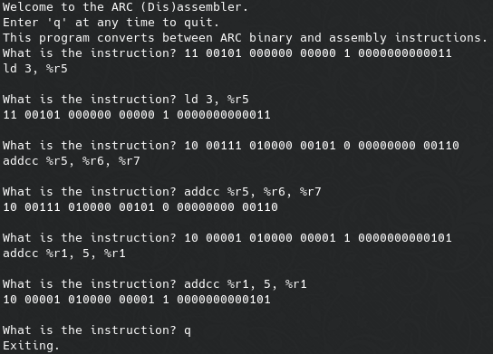

# ARC bin to asm

Converts between 32-bit ARC binary and assembly instructions.

## About

* The ARC Instruction Set Architecture (ISA) is a subset of the SPARC ISA used for learning the basics of assembly language.
* This program:
  * Converts ARC binary to assembly if given a 32-bit binary code.
  * Converts ARC assembly to binary if given a corresponding instruction.
* If you would like to familiarize yourself with the ARC ISA, you can find some relevant slides [here](http://www.math.uaa.alaska.edu/~afkjm/cs221/handouts/ISA.pdf).

## Usage

* Clone the repository: `git clone https://github.com/cw417/arc-bin-to-asm`
* Run the program: `python3 main.py`
* Enter a 32-bit ARC binary instruction or assembly instruction to convert it.
* Enter `q` to quit.

## Examples

